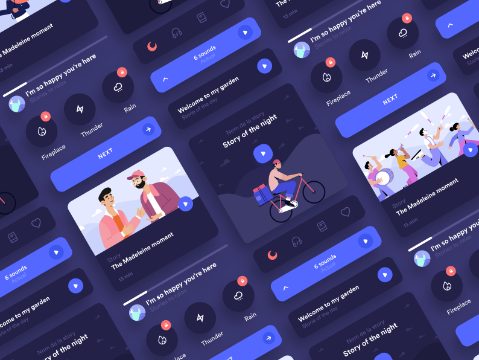

<!-- markdownlint-disable-next-line -->
<p align="center">
  
  
</p>
<h1 align="center">RanaUI</h1>

<div align="center">

[](https://github.com/mui-org/material-ui/blob/HEAD/LICENSE)
[](https://www.npmjs.com/package/@mui/material)
[](https://www.npmjs.com/package/@mui/material)
[](https://www.npmjs.com/package/@mui/material)
[](https://codecov.io/gh/mui-org/material-ui/branch/master)
[](https://github.com/mui-org/material-ui/issues/27062)
[](https://isitmaintained.com/project/mui-org/material-ui 'Average time to resolve an issue')
[](https://translate.mui.com/project/material-ui-docs)

</div>

## Introduction

This is a superset of the most commonly used front-end components based on Emotion CSS, guiding you to recognize, learn and use the right components to build your own pages, including PC and Mobile, shop around for experience, and very low-cost style copying , easily build your own theme system, let the page get the same experience as the native APP

## Browser Support

Recent versions of **Firefox**, **Chrome**, **Edge**, **Opera** and **Safari**. **IE11+**

## Major features

- Emotion-based styling solutions
- **Out-of-the-box** common mobile development functions
- ES6 and CommonJS modules
- Tree shaking of ES6 modules
- Almost the **best API** to use on the market
- **Zero-cost** style overrides and theme configuration
- Sophisticated and elegant style design
- An [API](https:///) for JavaScript and Typescript

## CDN Links

- https://cdn.jsdelivr.net/npm/rana-ui/dist/index.umd.js

# Install inside a NPM project

```bash
# npm
npm install rana-ui
```

```bash
# yarn
yarn add rana-ui
```

```bash
# pnpm
pnpm add rana-ui
```

## Use

### Use individual components:

Here is a quick example to get you started, **it's all you need**:

```jsx
import React from 'react';
import ReactDOM from 'react-dom';
import { Button } from 'rana-ui';

function App() {
  return <Button>Hello World</Button>;
}

ReactDOM.render(<App />, document.querySelector('#app'));
```

## Contribution

Please make sure to read the [Contributing Guide](https://github.com/fogcity/ui/contributing.md) before making a pull request and commit with [Commit Guide](https://github.com/fogcity/ui/commit-convention.md).

Thank you to all the people who already contributed to us!

## License

[MIT](https://opensource.org/licenses/MIT)
